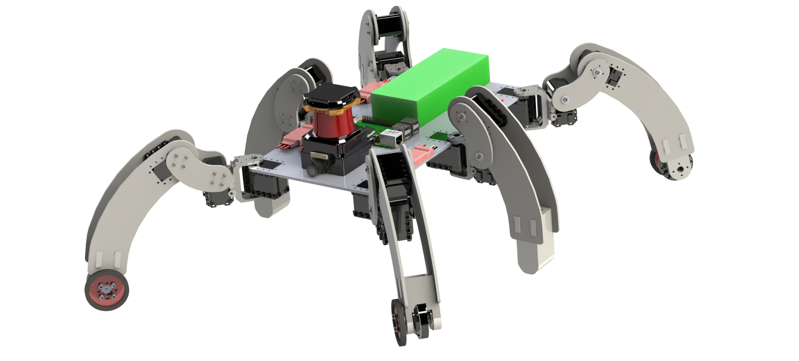
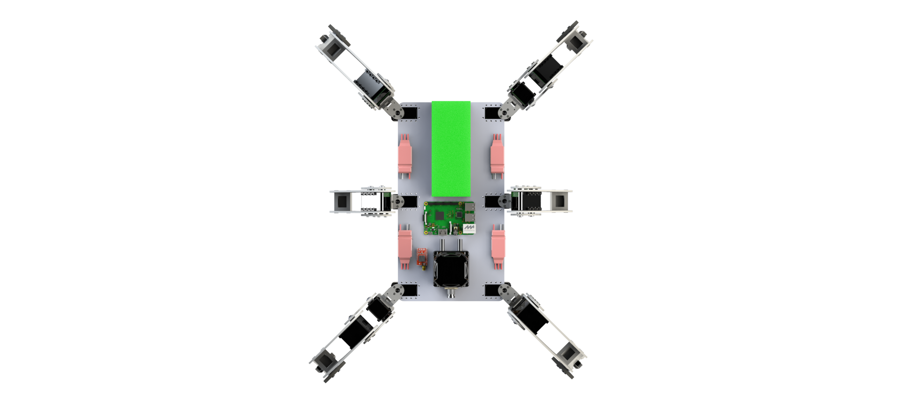

# SigSent
Created for EECS Senior Design at UCF Fall 2017 - Spring 2018 by Joshua Lee Franco, John Millner, Jeff Strange, and Richie Wales

SigSent is an intelligent, multi-terrain hexapod robot built for robust, reliable security solutions. Using an evolved Neural Network using NeuroEvolution of Augementing Topologies (NEAT), SigSent determines when the road is getting rough and automatically transition from a four-legged drive mode into a walking mode using all six of its legs. This allows base operators to work at a higher level, simply providing GPS routes to the robot and leaving it to figure out the rest itself.

SigSent's gait is generated using a Genetic Algorithm to find the most optimal, stable walking motion under its given load.

SigSent features a computer vision module that runs a basic pedestrian detection algorithm so that base operators can be notified if an anomalous figure has appeared that needs addressing.

The base operator can also TeleOp with a provided joystick, listen to audio from the robot's integrated microphone, and also use a headset of their own to output audio from SigSent's own speakers for two-way communication. Diagnostic information regarding things like battery life, servo pose information, and CV/NEAT outputs are provided as well in the GUI application. The interface was created using PyQt5, Python bindings for Qt5.

